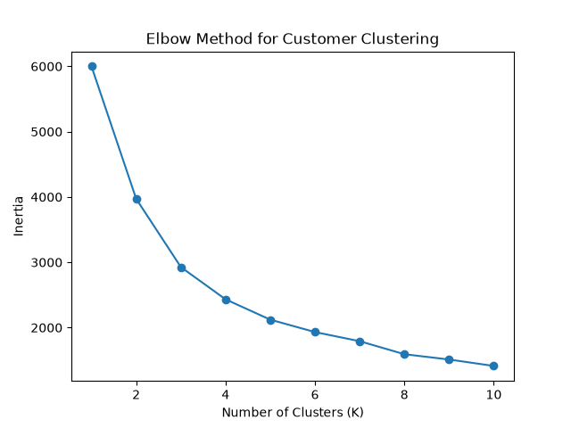
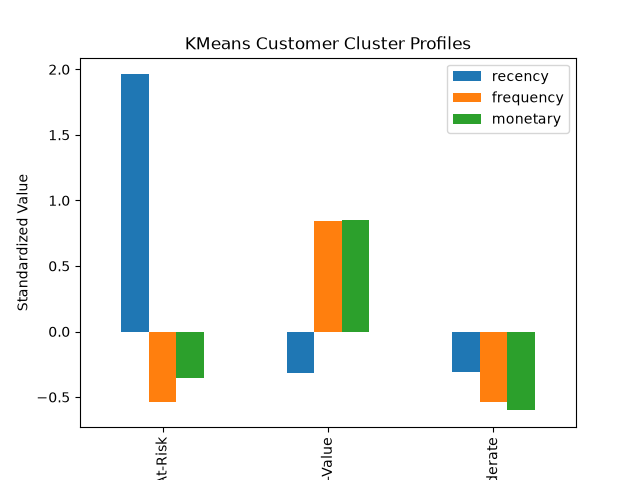
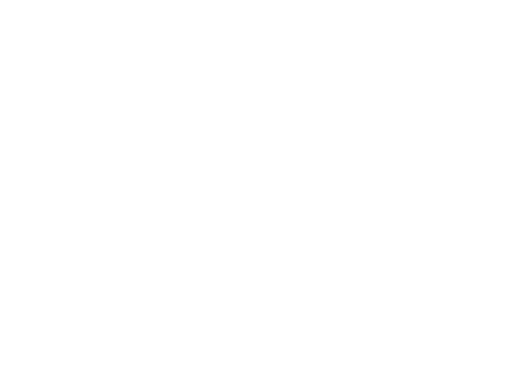

# Retail Data Warehouse

A hands-on data engineering, analytics, and machine learning project that demonstrates the design and implementation of a retail data warehouse using a **Medallion Architecture**.

The project processes retail sales data through three data layers:

- **Bronze** — preserves raw source data
- **Silver** — cleans, validates, and enriches the data
- **Gold** — creates business-level aggregations for analytics and reporting

The original data engineering pipeline was expanded in Version 2 to support **50,000 sales transactions across 2,000 customers**, exploratory data analysis, RFM customer segmentation, and KMeans machine learning.

The project uses **Python, Pandas, PostgreSQL, Docker, Jupyter Notebook, scikit-learn, and Matplotlib** to move from raw transactional data to analytics-ready datasets, customer segmentation, and data-driven business insights.

## Architecture

The data pipeline follows a layered Medallion Architecture that progressively transforms raw retail sales data into business-ready information.

**Raw Sales Data → Bronze → Silver → Gold**

### Bronze — Raw Data

Raw sales data is ingested from the source CSV file and loaded into PostgreSQL without modifying the original business data. This layer serves as the system of record for rebuilding downstream layers.

### Silver — Clean and Validated Data

Data from the Bronze layer is cleaned, typed, validated, and enriched. Business transformations such as calculating `total_amount` are applied before the records are loaded into the Silver layer.

### Gold — Business Analytics

Validated Silver data is transformed into business-level summaries and aggregations designed for analytics, reporting, and downstream consumption.

## Technology Stack

| Technology | Purpose |
|---|---|
| **Python** | ETL pipeline development and data processing |
| **Pandas** | Data extraction, transformation, validation, and aggregation |
| **Jupyter Notebook** | Exploratory data analysis, RFM analysis, and machine learning experimentation |
| **scikit-learn** | Feature standardization and KMeans customer clustering |
| **Matplotlib** | Data analysis and machine learning visualizations |
| **PostgreSQL** | Relational database for the Bronze, Silver, and Gold layers |
| **psycopg2** | Python-to-PostgreSQL database connectivity |
| **Docker** | Containerized PostgreSQL and pgAdmin environment |
| **pgAdmin** | Database inspection, SQL queries, and data verification |
| **VS Code** | Development environment for Python, SQL, and project files |
| **Git / GitHub** | Version control and project repository |

## Project Structure

The repository separates source data, Python ETL logic, SQL scripts, documentation, analytics notebooks, machine learning workflows, and supporting assets into dedicated directories.

```text
retail-data-warehouse/
│
├── data/
│   ├── raw/                         # Source retail sales data
│   ├── bronze/                      # Bronze-layer data
│   ├── silver/                      # Silver-layer data
│   ├── gold/                        # Gold-layer data
│   └── notebooks/                   # Analytics and machine learning notebooks
│       ├── retail_sales_eda.ipynb
│       └── customer_clustering.ipynb
│
├── diagrams/                        # Architecture and data-flow diagrams
├── docs/                            # Project documentation
├── images/                          # Images used for documentation
│   └── 11_machine_learning/
│       ├── elbow_method.png
│       ├── kmeans_cluster_profiles.png
│       └── rfm_vs_kmeans.png
│
├── python/
│   ├── config/
│   ├── etl/
│   │   ├── load_sales_to_bronze.py
│   │   ├── transform_sales_to_silver.py
│   │   └── transform_sales_to_gold.py
│   ├── tests/
│   └── utils/
│       └── generate_sales_data.py
│
├── sql/
│   ├── ddl/
│   ├── dml/
│   ├── etl/
│   ├── queries/
│   └── views/
│
├── docker-compose.yml
├── requirements.txt
└── README.md
```

## ETL Pipeline Workflow

The pipeline moves retail sales data through the Bronze, Silver, and Gold layers using separate Python ETL processes.

### 1. Source Data Generation

`generate_sales_data.py` creates sample retail sales data used as the source dataset for the pipeline.

### 2. Bronze — Extract and Load

`load_sales_to_bronze.py` reads the raw sales CSV file and loads the source records into the Bronze layer of PostgreSQL.

The Bronze layer preserves the raw source data so downstream layers can be rebuilt when necessary.

### 3. Silver — Transform and Validate

`transform_sales_to_silver.py` extracts records from the Bronze layer and prepares clean, validated data.

Transformations include:

- Converting dates to the appropriate data type
- Validating required fields and values
- Enforcing data-quality rules
- Calculating `total_amount`
- Loading the transformed records into the Silver layer

### 4. Gold — Aggregate for Analytics

`transform_sales_to_gold.py` reads validated Silver data and creates business-level aggregations for analytics and reporting.

The Gold layer represents the final analytics-ready stage of the pipeline.

## Development and Verification Workflow

Each layer of the pipeline is developed and verified before moving to the next stage.

The workflow used throughout the project is:

**VS Code → Terminal → PostgreSQL / pgAdmin → Verification → Next Layer**

### Development

Python and SQL code is written and maintained in VS Code.

### Execution

ETL scripts are executed from the VS Code terminal. Terminal output is reviewed to confirm that the script completed successfully.

### Database Verification

After an ETL process runs, PostgreSQL is inspected using pgAdmin to verify that the expected data was actually loaded.

Verification includes:

- Confirming tables exist
- Checking row counts
- Reviewing column names and data types
- Inspecting sample records
- Validating calculated values
- Confirming data-quality constraints

### Layer Validation

A layer is considered complete only after both the ETL process and the resulting database records have been verified.

Once verification is successful, development proceeds to the next layer.

## Database Design

The PostgreSQL database is organized using separate schemas for each stage of the Medallion Architecture.

### Bronze Schema

The Bronze schema stores the raw ingested sales records.

Primary table:

- `bronze.sales_raw`

The table preserves the source data and includes source-file information so records can be traced back to their origin.

### Silver Schema

The Silver schema stores cleaned and validated sales records.

Primary table:

- `silver.sales_clean`

The Silver table applies data types, required-field constraints, data-quality checks, and derived values such as `total_amount`.

### Gold Schema

The Gold schema contains business-level aggregations created from validated Silver data.

Primary table:

- `gold.product_sales_summary`

Each row represents the summarized sales performance of one product.

The table contains the following analytical metrics:

- `product_id` — unique product identifier and primary key
- `total_orders` — total number of orders containing the product
- `total_quantity` — total number of units sold
- `total_sales` — total sales revenue generated by the product
- `gold_load_timestamp` — timestamp recording when the Gold summary was loaded

This structure allows product-level sales performance to be analyzed without repeatedly aggregating the detailed transactional records stored in the Silver layer.

## Prerequisites

Before running the project, make sure the following software is installed:

- **Docker Desktop**
- **Python 3**
- **VS Code** or another code editor
- **Git**

The project uses Docker Compose to run PostgreSQL and pgAdmin, so PostgreSQL and pgAdmin do not need to be installed separately on the host computer.

Python dependencies are listed in `requirements.txt`.

## Setup

### 1. Clone the Repository

Clone the repository and open the project directory.

### 2. Configure Environment Variables

Create a `.env` file in the project root and define the credentials required by Docker and the Python ETL scripts.

Required environment variables:

- `POSTGRES_PASSWORD`
- `PGADMIN_DEFAULT_PASSWORD`

The `.env` file should not be committed to source control because it contains sensitive credentials.

### 3. Install Python Dependencies

Install the required Python packages from `requirements.txt`:

`pip install -r requirements.txt`

The project currently uses:

- `pandas`
- `psycopg2-binary`
- `python-dotenv`
- `jupyter`
- `scikit-learn`
- `matplotlib`

### 4. Start the Docker Environment

From the project root, start the PostgreSQL and pgAdmin containers:

`docker compose up -d`

Docker Compose starts:

- **PostgreSQL 16** on port `5432`
- **pgAdmin** on port `5050`
- PostgreSQL database: `retail_dw`

pgAdmin can then be accessed through a web browser at:

`http://localhost:5050`

### 5. Verify the Containers

Confirm that the containers are running:

`docker ps`

The environment should include:

- `retail-postgres`
- `retail-pgadmin`

## Run the Pipeline

Once the Docker environment is running, initialize the database objects and execute the ETL pipeline in layer order.

### 1. Initialize the Database

Docker Compose automatically creates the `retail_dw` database.

Using pgAdmin, connect to `retail_dw` and execute the SQL scripts in the following order:

1. `sql/ddl/02_create_schemas.sql`
2. `sql/ddl/03_create_bronze_tables.sql`
3. `sql/ddl/04_create_silver_tables.sql`
4. `sql/ddl/05_create_gold_tables.sql`

> **Note:** `01_create_database.sql` is provided for environments where the PostgreSQL database is created manually. It is not required when using the Docker Compose configuration.

### 2. Generate the Source Data

From the project root, generate the sample retail sales dataset:

`python python/utils/generate_sales_data.py`

This creates the source data used by the ETL pipeline.

### 3. Load the Bronze Layer

Run the Bronze ingestion process:

`python python/etl/load_sales_to_bronze.py`

Verify the results in pgAdmin before continuing.

### 4. Transform the Silver Layer

Run the Silver transformation:

`python python/etl/transform_sales_to_silver.py`

Verify the cleaned records, data types, calculated values, and row counts in pgAdmin.

### 5. Build the Gold Layer

Run the Gold aggregation:

`python python/etl/transform_sales_to_gold.py`

Verify the resulting records in:

`gold.product_sales_summary`

### Pipeline Execution Order

`Raw Sales Data → Bronze → Silver → Gold`

Each layer should be successfully executed and verified before proceeding to the next stage.

## Pipeline Results

The completed pipeline was validated in PostgreSQL using pgAdmin.

### Bronze Layer

The Bronze layer contains **10 raw sales records** loaded from the source dataset.

`bronze.sales_raw` — **10 rows**

### Silver Layer

After transformation and validation, the Silver layer contains **10 cleaned sales records**.

`silver.sales_clean` — **10 rows**

The matching Bronze and Silver row counts confirm that all source transactions successfully progressed through the transformation stage.

### Gold Layer

The Gold pipeline aggregates the 10 Silver transactions into **6 product-level summaries**.

| Product | Total Orders | Total Quantity | Total Sales |
|---|---:|---:|---:|
| P101 | 2 | 6 | $119.94 |
| P102 | 2 | 8 | $100.00 |
| P103 | 1 | 2 | $49.00 |
| P104 | 2 | 3 | $149.97 |
| P105 | 2 | 2 | $179.98 |
| P106 | 1 | 1 | $129.99 |

The final Gold dataset demonstrates the progression from detailed transactional data to analytics-ready business metrics.

**10 Raw Records → 10 Clean Records → 6 Product Summaries**

---

# Retail Data Warehouse V2

Version 2 expands the original data engineering project into a larger analytics and machine learning workflow.

## Dataset Expansion

Version 2 expands the synthetic retail dataset to **50,000 sales transactions** across **2,000 customers**, creating a larger dataset for exploratory analysis, customer segmentation, and machine learning.

## Exploratory Data Analysis

Exploratory Data Analysis (EDA) was performed in Jupyter Notebook to understand the structure, quality, and business patterns within the expanded retail dataset.

The analysis included:

- Descriptive statistics
- Sales trends over time
- Product and store performance
- Payment method analysis
- Customer purchase distribution
- Order size analysis
- Daily and weekly sales trends

## RFM Customer Analysis

RFM analysis was used to evaluate customer purchasing behavior across three dimensions:

- **Recency** — how many days have passed since the customer's most recent purchase
- **Frequency** — how often the customer made purchases
- **Monetary** — the total amount spent by the customer

The 2,000 customers were scored using these RFM metrics and assigned to four rule-based business segments:

- **At Risk**
- **Developing**
- **Loyal**
- **Champions**

## Machine Learning — KMeans Customer Clustering

Unsupervised machine learning was used to identify natural customer groups based on **Recency, Frequency, and Monetary behavior**.

The RFM features were standardized using `StandardScaler` so that each feature contributed on a comparable scale.

The Elbow Method was then used to evaluate different values of K. Based on the resulting inertia curve, **K = 3** was selected as a reasonable number of customer clusters.

KMeans identified three behavioral groups:

- **At-Risk / Inactive** — customers with high recency, lower purchase frequency, and below-average spending
- **High-Value** — customers with recent purchases, high purchase frequency, and the highest monetary value
- **Moderate** — customers with relatively recent purchases but lower frequency and monetary value than the High-Value group

## RFM Segmentation vs KMeans Clustering

The rule-based RFM segmentation was compared with the KMeans clusters to determine how closely the business-defined customer groups aligned with patterns discovered by machine learning.

Key findings:

- **Champions:** 432 of 442 customers were classified by KMeans as High-Value.
- **At Risk:** None of the 426 At Risk customers were classified as High-Value.
- **Developing:** 417 of 549 customers were classified as Moderate.
- **Loyal:** Customers were more divided, with 310 classified as High-Value and 257 as Moderate.

The comparison shows strong agreement for the highest-value customers, while the Developing and Loyal segments show greater overlap between behavioral groups.

## Machine Learning Visualizations

### Elbow Method

The Elbow Method was used to evaluate the relationship between the number of clusters and model inertia.



### KMeans Cluster Profiles

The standardized cluster profiles show how Recency, Frequency, and Monetary behavior differ across the three customer groups.



### RFM Segments vs KMeans Clusters

The rule-based RFM segments were compared with the KMeans clusters to evaluate how business-defined customer categories align with data-driven behavioral patterns.



